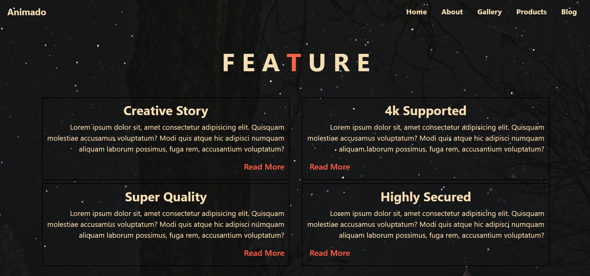
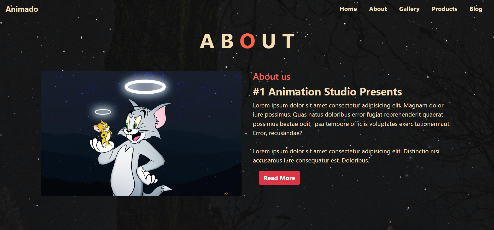
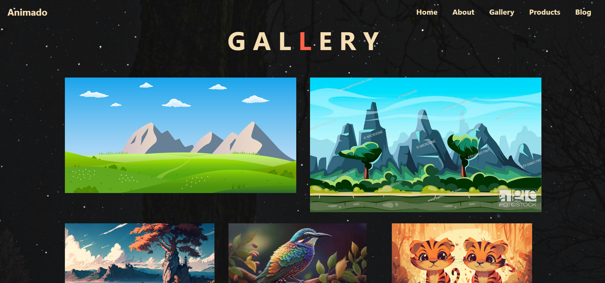
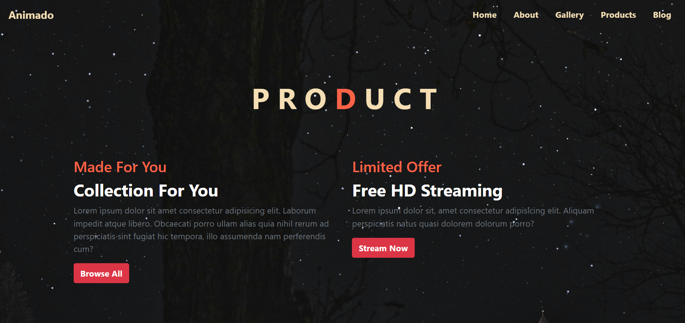
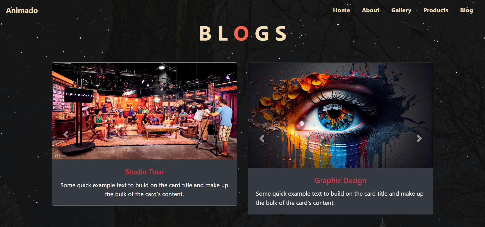

# 📌 Anime Website

A stunning and responsive website built with HTML and CSS. This project showcases a clean and modern design with smooth UI/UX elements.

## 🚀 Live Demo
🔗 [Click here to view the live site](#) *(https://sakshi-2508.github.io/Anime-Website-Bootstrap/)*

---

## 📸 Screenshots

<div>
    
</div>

<div>
    
</div>

<div>
    
</div>

<div>
    
</div>

<div>
    
</div>

<div>
    
</div>

---

## 🛠️ Features
- 🔥 **Fully Responsive**: Works seamlessly on all devices.
- 🎨 **Modern UI/UX**: Elegant design with smooth animations.
- ⚡ **Optimized Performance**: Fast-loading and efficient code.
- 🌙 **Dark Mode Support** *(If applicable)*
- 🎯 **Easy to Customize**: Well-structured and modular code.

---

## 📂 Project Structure
```plaintext
📦 Project
├── 📁 images      # Images, icons, and other assets
├── 📜 index.html  # Main HTML & CSS file
└── 📜 README.md   # Project documentation
```

---

## 💻 Installation & Usage

1. **Clone the repository**
   ```sh
   git clone https://github.com/Sakshi-2508/Anime-Website-Bootstrap.git
   ```
2. **Navigate to the project directory**
   ```sh
   cd Anime-Website-Bootstrap
   ```
3. **Open `index.html` in your browser**

---

## 🎨 Customization
- Modify the `index.html` file to change colors, fonts, or layouts.
- Replace images in the `images/` folder with your own.
- Edit `index.html` to customize content as needed.

---

## 🤝 Contributing
Contributions, issues, and feature requests are welcome! Feel free to **fork** this repository and submit a **pull request**.

---

## 📝 License
This project is **open-source** and available under the [MIT License](LICENSE).

---

## 🌟 Show Your Support
If you like this project, please consider giving it a **⭐ on GitHub**! Your support is much appreciated. 😊

